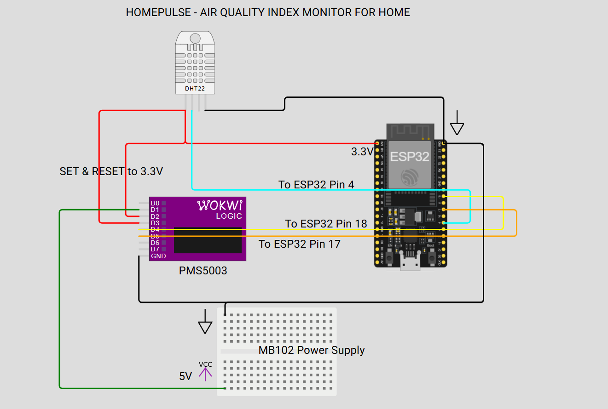

# HomePulse

**HomePulse is a personal ambient environmental monitoring system built around an ESP32-S3, DHT22, and PMS5003 sensors.**

The device measures temperature, humidity, and particulate matter and sends the readings to a web dashboard for monitoring environmental conditions over time.

The project combines embedded firmware, sensor interfacing, a web application, and persistent storage into a small end-to-end IoT system.

## What it measures

HomePulse currently collects:

| Measurement | Sensor  | Unit  |
| ----------- | ------- | ----- |
| Temperature | DHT22   | °C    |
| Humidity    | DHT22   | %     |
| PM1.0       | PMS5003 | µg/m³ |
| PM2.5       | PMS5003 | µg/m³ |
| PM10        | PMS5003 | µg/m³ |

The PMS5003 measures particulate matter concentrations in ambient air, including PM1.0, PM2.5, and PM10, reported in µg/m³.

## Hardware

* ESP32-S3
* DHT22 temperature/humidity sensor
* PMS5003 particulate matter sensor
* MB102 breadboard power supply
* Breadboard and jumper wires
* Optional push button for spot measurements

### Pin diagram



### Wiring

| Component          | Pin       | Connection      | Notes                               |
| ------------------ | --------- | --------------- | ----------------------------------- |
| **ESP32-S3**       | USB-C     | Computer USB-C  | Powers the ESP32-S3                 |
| **DHT22**          | VCC       | ESP32-S3 3.3V   | 3.3V supplied directly by ESP32-S3  |
| **DHT22**          | GND       | Common GND      |                                     |
| **DHT22**          | DATA      | GPIO4           |                                     |
| **PMS5003**        | VCC       | MB102 5V        | PMS5003 is powered from 5V          |
| **PMS5003**        | GND       | Common GND      | Shared with ESP32-S3 and MB102      |
| **PMS5003**        | SET       | ESP32-S3 3.3V   | Must be supplied from ESP32-S3 3.3V |
| **PMS5003**        | RESET     | ESP32-S3 3.3V   | Must be supplied from ESP32-S3 3.3V |
| **PMS5003**        | TX        | ESP32-S3 GPIO18 | PMS5003 TX → ESP32-S3 RX            |
| **PMS5003**        | RX        | ESP32-S3 GPIO17 | PMS5003 RX → ESP32-S3 TX            |
| **Capture button** | One leg   | ESP32-S3 GPIO5  |                                     |
| **Capture button** | Other leg | GND             | Internal pull-up is used            |

### Power arrangement

The ESP32-S3 is powered from the computer through its **USB-C connection**.

The MB102 provides the **5V supply required by the PMS5003**. The MB102 and ESP32-S3 share a common ground.

The ESP32-S3's **3.3V output is used for the DHT22 and the PMS5003 SET and RESET pins**. The 3.3V output from the MB102 is not used for these connections.

The ESP32-S3 does not supply the 5V rail used to power the PMS5003.

The PMS5003 is powered from the **5V supply**, not 3.3V.

The sensor fan takes approximately 30 seconds to spin up and stabilize after power-on. Initial readings may therefore be noisy.

## System architecture

```text
┌──────────────────────┐
│      Sensors         │
│                      │
│  DHT22               │
│  Temperature         │
│  Humidity            │
│                      │
│  PMS5003             │
│  PM1.0 / PM2.5 / PM10│
└──────────┬───────────┘
           │
           │ UART / GPIO
           ▼
┌──────────────────────┐
│      ESP32-S3         │
│                       │
│   MicroPython         │
│   Sensor drivers      │
│   Capture modes       │
└──────────┬───────────┘
           │
           │ Wi-Fi
           │ HTTPS / HTTP
           ▼
┌──────────────────────┐
│   HomePulse Web App  │
│                      │
│   SvelteKit          │
│   TypeScript         │
│   API endpoints      │
└──────────┬───────────┘
           │
           ▼
┌──────────────────────┐
│       Turso          │
│   Sensor readings    │
└──────────────────────┘
```

## Firmware

The firmware is written in **MicroPython** and lives under [`firmware/`](./firmware).

The firmware:

1. Connects the ESP32-S3 to Wi-Fi.
2. Reads the DHT22.
3. Reads the PMS5003 over UART.
4. Validates the PMS5003 frame checksum.
5. Builds a sensor-reading payload.
6. Sends the reading to the HomePulse `/api/ingest` endpoint.
7. Continues according to the configured capture mode.

### PMS5003 protocol

The PMS5003 communicates over UART at **9600 baud, 8N1**.

The driver scans the incoming byte stream for the PMS5003 start sequence:

```text
0x42 0x4D
```

It then reads the remaining bytes of the 32-byte frame and validates the checksum before returning the measurements.

The driver reports:

```text
PM1.0
PM2.5
PM10
```

If a frame is incomplete, times out, or fails checksum validation, the reading is discarded rather than being treated as valid sensor data.

See [`firmware/sensors/pms5003.py`](./firmware/sensors/pms5003.py) for the implementation.

## Capture modes

HomePulse supports two firmware capture modes.

### Continuous mode

The device remains in one location and periodically sends readings automatically.

```text
Sensor reading
      ↓
Send to HomePulse
      ↓
Wait
      ↓
Sensor reading
      ↓
...
```

The interval is configured in `config.py`.

The default configuration is **5 minutes**.

### Spot mode

The device can be carried from room to room and a reading is captured when the physical button is pressed.

This makes it possible to compare environmental conditions between different locations without requiring a permanently installed sensor in every room.

The web application is responsible for identifying the target room. The firmware itself does not know which room it is in.

## Web application

The HomePulse dashboard is built with:

* **SvelteKit**
* **Svelte 5**
* **TypeScript**
* **Tailwind CSS**
* **Drizzle ORM**
* **Turso / libSQL**
* **Vercel**

The web application provides the interface for viewing sensor data and managing capture settings.

The ESP32 sends readings to the application's ingestion endpoint using an API key.

## Project structure

```text
homepulse/
├── firmware/
│   ├── sensors/
│   │   ├── dht22.py
│   │   └── pms5003.py
│   ├── boot.py
│   ├── config.py.example
│   ├── main.py
│   └── README.md
│
├── src/
│   └── ...
│
├── static/
│   ├── PinDiagram.png
│   └── ...
│
├── package.json
├── drizzle.config.ts
├── vercel.json
└── README.md
```

## Local development

### Web application

Install dependencies:

```bash
npm install
```

Start the development server:

```bash
npm run dev
```

For a production build:

```bash
npm run build
```

Other useful commands:

```bash
npm run check
npm run lint
npm test
```

### Database

Database commands are provided through Drizzle:

```bash
npm run db:push
npm run db:generate
npm run db:migrate
npm run db:studio
```

Production room names and application settings are stored in the configured
database, not on the ESP32 or in Vercel's filesystem. Vercel deployments
must use the persistent Turso `DATABASE_URL` and `DATABASE_AUTH_TOKEN`;
the app now refuses to start on Vercel if `DATABASE_URL` points to a local
`file:` database, which would otherwise be ephemeral. Confirm these
variables are set for the Vercel environment serving the app (Production,
Preview, or both as appropriate). Local `.env` values are not automatically
copied into Vercel. The app does not recreate or clear rooms on startup;
rooms are removed only through the Settings UI or by deleting/changing the
database itself.

## ESP32 setup

### 1. Install the tools

Install `esptool` and `mpremote`:

```bash
pip install esptool mpremote --break-system-packages
```

### 2. Flash MicroPython

Download the appropriate ESP32-S3 MicroPython firmware for the board.

Put the ESP32-S3 into bootloader mode and erase the existing flash:

```bash
esptool.py --chip esp32s3 --port <YOUR_PORT> erase_flash
```

Then flash MicroPython:

```bash
esptool.py --chip esp32s3 --port <YOUR_PORT> write_flash -z 0 <downloaded>.bin
```

### 3. Configure the device

Copy the example configuration:

```bash
cd firmware
cp config.py.example config.py
```

Set:

* Wi-Fi SSID
* Wi-Fi password
* HomePulse API URL
* ingestion API key
* capture mode
* sensor configuration

`config.py` is intentionally gitignored. Do not commit real Wi-Fi credentials or API keys.

### 4. Install the MicroPython dependency

```bash
mpremote connect <YOUR_PORT> mip install urequests
```

### 5. Copy the firmware

```bash
mpremote connect <YOUR_PORT> fs cp boot.py :boot.py
mpremote connect <YOUR_PORT> fs cp main.py :main.py
mpremote connect <YOUR_PORT> fs cp config.py :config.py

mpremote connect <YOUR_PORT> fs mkdir :sensors
mpremote connect <YOUR_PORT> fs cp sensors/dht22.py :sensors/dht22.py
mpremote connect <YOUR_PORT> fs cp sensors/pms5003.py :sensors/pms5003.py
```

Connect to the device:

```bash
python -m mpremote connect <YOUR_PORT> repl
```

On Windows, find the port in **Device Manager → Ports (COM & LPT)** (for
example, `COM9`). From the `firmware` directory, list the board's files
with `python -m mpremote connect COM9 fs ls :`, copy changed files with
`python -m mpremote connect COM9 fs cp main.py :main.py` (replace the
source/destination for the file you changed), and list files inside
`sensors` with `python -m mpremote connect COM9 fs ls :sensors`. In the
REPL, **Ctrl-D** soft-resets the board and **Ctrl-]** exits back to
PowerShell. See [firmware/README.md](./firmware/README.md#windows-testing-and-debugging)
for the complete Windows testing and debugging steps.

## Configuration

The main firmware settings are stored in `firmware/config.py`.

Example:

```python
MODE = "continuous"
CONTINUOUS_INTERVAL_SECONDS = 300

DHT22_PIN = 4

ENABLE_PMS5003 = True
PMS5003_UART_ID = 1
PMS5003_TX_PIN = 17
PMS5003_RX_PIN = 18

CAPTURE_BUTTON_PIN = 5
```

The firmware keeps the hardware configuration separate from the application code so that pin assignments and operating modes can be changed without modifying the sensor drivers.

## Local ESP32 testing

When testing against a locally running HomePulse server, the ESP32 cannot use `localhost` to reach the development machine.

Use the computer's LAN IP instead:

```python
API_BASE_URL = "http://192.168.1.50:5173"
```

Replace the IP address with the address of the computer running the development server.

Once the application is deployed, the ESP32 can be configured to use the production URL.

## Design notes

### Sensor failure isolation

A failed sensor reading should not prevent other measurements from being recorded.

The firmware therefore treats individual sensor failures as missing values rather than crashing the entire capture loop.

For example, if the PMS5003 fails to provide a valid frame, the DHT22 reading can still be sent.

### PMS5003 frame validation

The PMS5003 driver does not blindly trust incoming UART data.

It:

* synchronizes on the `0x42 0x4D` start sequence
* reads the complete frame
* validates the checksum
* discards invalid frames
* returns only validated measurements

### Room-aware measurements

In spot mode, the ESP32 does not attempt to determine its physical location.

Instead, the user arms the target room in the HomePulse web application before pressing the capture button. This keeps the firmware simple while allowing the application to associate measurements with locations.

## Status

HomePulse is an active personal hardware/software project.

Current hardware support:

* ESP32-S3
* DHT22
* PMS5003
* Optional capture button

Current sensor pipeline:

```text
DHT22 ──────┐
            │
            ▼
         ESP32-S3 ─── Wi-Fi ───► HomePulse API ───► Database
            ▲
            │
PMS5003 ────┘
```

## License

This project is currently maintained as a personal project. License terms will be added when the project is formally released.
